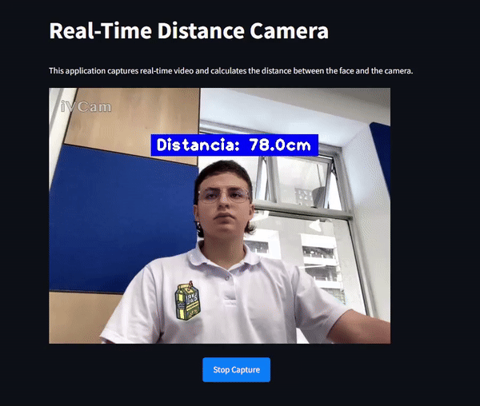

# Live Distance Measurement (Medición de Distancia en Vivo)

### Description
This project implements a real-time distance measurement system using a webcam and face mesh technology. The script `live_distance_measurement.py` captures video from a webcam and utilizes the `DistanceCamera` class to calculate the distance from the camera to a person's face.

### Installation
Follow these steps to set up the project environment:

1. Clone the repository:

git clone [<https://github.com/GitSantiagopf/FaceDistanceTracker>]

2. Navigate to the project directory:

cd FaceDistanceTracker

3. Install the required dependencies:

pip install -r requirements.txt

### Usage
Execute the script to run the application:
python live_distance_measurement.py

For a demonstration of the application in action, see the following GIF:

### Project Organization
The project is organized as follows:
- `.env`: Environment variables for configuration.
- `.gitignore`: Specifies intentionally untracked files to ignore.
- `distance_camera`: Module containing the `DistanceCamera` class.
- `live_distance_measurement.py`: Main script that initiates the distance measurement.
- `requirements.txt`: Contains all the necessary Python packages.
- `styles.css`: Custom CSS styles for the application.

### Contributing
Contributions to this project are welcome. Please fork the repository and submit a pull request with your changes.